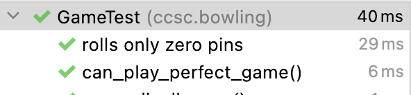
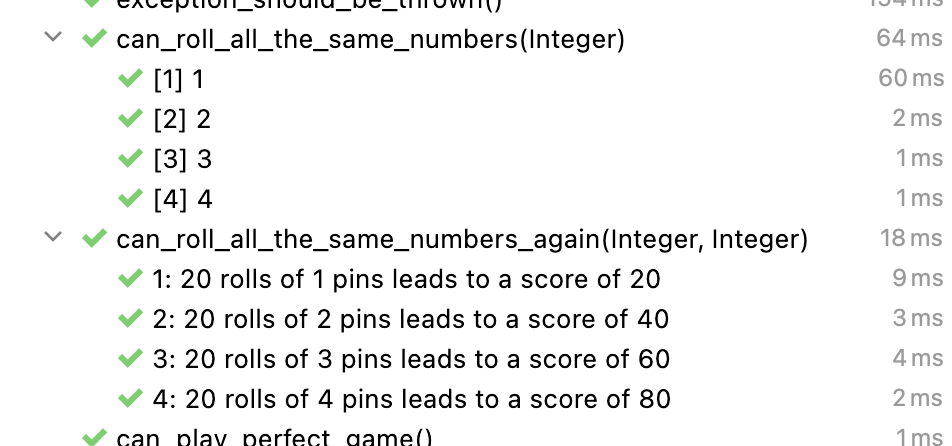

== Erweiterte Testfunktionen

=== Umfrage

Welche Features/Themen sind Euch wichtig, wenn Ihr Tests schreibt?

Antworten im Klasse `GameTest` sammeln.

=== Lesbare Tests

==== Methodennamen

Methoden brauchen kein `test`-Präfix mehr. Das ist ein Relikt aus JUnit 3.

Ziel: sprechende Namen verwenden, so dass sich die Methoden wie ein natürlicher Satz lesen. Sprache (Deutsch/Englisch) ist grundsätzlich erstmal egal, aber man sollte sich an die Sprache der Domäne (Ubiquituous Language) halten.

Mit `@DisplayName("beliebiger Name oder auch ein ganzer Satz")` lassen sich sprechende Test-Beschreibungen erzeugen.

```java
    @Test
    @DisplayName("rolls only zero pins")
    void can_roll_gutter_game() {
        rollMany(20, 0);
        assertEquals(0, game.getScore());
    }
```

.Lesbare Anzeige in den Test-Resultaten


Weitere Ideen für die Benamung von Test-Methoden finden sich bei https://stackoverflow.com/questions/155436/unit-test-naming-best-practices[Stackoverflow].

==== Bessere Assertions

Die von JUnit mitgelieferten `Assertions` reichen grundsätzlich aus, haben aber einige Schwächen. Einerseits sind die Test nicht so gut lesbar und beim Fehlschlagen sind die Fehlermeldungen häufig nicht wirklich hilfreich.

```java
    @Test
    void can_roll_all_ones() {
        rollMany(20, 1);
        assertTrue(game.getScore() == 21);
        assertEquals(21, game.getScore());
    }
```

```
org.opentest4j.AssertionFailedError:
Expected :true
Actual   :false
<Click to see difference>
	at ccsc.bowling.GameTest.can_roll_all_ones(GameTest.java:47)
        [..]
```

```
org.opentest4j.AssertionFailedError:
Expected :21
Actual   :20
<Click to see difference>
    at ccsc.bowling.GameTest.can_roll_all_ones(GameTest.java:48)
    [..]
```

Da bieten sich Bibliotheken für Fluent Assertions wie Hamcrest oder AssertJ an.

Beim Tippen: `Assertions.assertThat()` (richtige Klasse auswählen) und dann ⌥ + ⏎ für Quickfix -> Static Import.

```java
    @Test
    void can_roll_all_ones() {
        rollMany(20, 1);
        assertThat(game.getScore()).isEqualTo(20);
    }
```

Man kann die Assertions sogar noch besser beschreiben:

```java
    @Test
    void can_roll_all_ones() {
        rollMany(20, 1);
        assertThat(game.getScore())
                .as("Game with %s rolls of %s pin(s)", 20, 1)
                .isEqualTo(21);
    }
```

```
org.opentest4j.AssertionFailedError: [Game with 20 rolls of 1 pin(s)]
expected: 21
 but was: 20
Expected :21
Actual   :20
<Click to see difference>
```

Das hilft vor allem auch bei Boolean-Vergleichen, wo man nicht direkt weiß, warum es gerade schief läuft.

Das Auftreten von Exceptions kann man mit AssertJ folgendermaßen prüfen:

```java
    @Test
    void exception_should_be_thrown() {
        assertThatThrownBy(() -> {
            List<Integer> list = Arrays.asList(1, 2);
            list.get(100);
        }).isInstanceOf(IndexOutOfBoundsException.class)
                .hasMessageContaining("Index 100 out of bounds for length 2");
    }
```

==== Given/When/Then

Given-When-Then ist ein Stil, wie man Tests schreiben kann. Es spezifiziert das System-Verhalten durch SpecificationByExample. Dieser Ansatz wurde von Daniel Terhorst-North und Chris Matts als Teil des Behavior-Driven Development (BDD) entwickelt. Es ist mittlerweile der Strukturierungsansatz für viele Test-Frameworks wie Cucumber. Die grundlegende Idee ist, ein Szenario (ein Test) in drei Bereiche zu untergliedern:

* der `Given`-Teil beschreibt den Zustand der Welt, vor dem Verhalten, welches dieses Szenario spezifiziert. Es sind sozusagen die Preconditions dieses Tests
* der `When`-Teil enthält das Verhalten, welches wir spezifizieren wollen
* schlussendlich beschreibt der `Then`-Teil die Änderungen, die durch das spezifizierte Verhalten erwartet werden

```java
    @Test
    void can_roll_all_ones() {
        // given
        Game game = new Game();

        // when
        rollMany(20, 1);

        // then
        assertEquals(20, game.getScore());
    }
```

=== Weitere Test Features
==== Lifecycle

Die `*All`-Methoden müssen static sein und werden nur einmal pro Testklasse ausgeführt. Das ist zum Beispiel gut, wenn man einmalig einen Docker-Container oder eine Datenbank hochfahren und am Ende wieder aufräumen möchte.

Die `*Each`-Methoden werden vor und nach jeder Test-Methode aufgerufen.

```java
    @BeforeEach
    void setup() {
        game = new Game();
        System.out.println("setup() was called");
    }

    @BeforeAll
    static void setupOnce() {
        System.out.println("setupOnce() was called");
    }

    @AfterEach
    void cleanup() {
        System.out.println("cleanup() was called");
    }

    @AfterAll
    static void cleanupOnce() {
        System.out.println("cleanupOnce() was called");
    }
```

==== Parameterized Tests

Hat man sehr ähnliche Testfälle mit viel Redundanz, bieten sich `ParameterizedTests` an:

```java
    @ParameterizedTest
    @ValueSource(ints = {1, 2, 3, 4})
    void can_roll_all_the_same_numbers(Integer pins) {
        rollMany(20, pins);
        assertThat(game.getScore()).isGreaterThan(0);
    }

    @ParameterizedTest(name = "{index}: 20 rolls of {0} pin(s) leads to a score of {1}")
    @CsvFileSource(resources = "/pins.csv", numLinesToSkip = 1)
    void can_roll_all_the_same_numbers_again(Integer pins, Integer score) {
        rollMany(20, pins);
        assertThat(game.getScore()).isEqualTo(score);
    }
```

.pins.csv
```csv
pins, score
1, 20
2, 40
3, 60
4, 80
```

.Ausgabe der parameterisierten Tests


Es gibt noch viele weitere Quellen:

* `@CsvSource({"abc,3", "Test,4", "hallo,5"})`
* `@EnumSource(Weekdays.class)`
* `@NullSource`, `@EmptySource`, `@NullAndEmptySource`, ...
* `@MethodSource("provideStringsForIsBlank")` und private static Stream<Arguments> provideStringsForIsBlank() {}`
* `@ArgumentsSource(BlankStringsArgumentsProvider.class)` und `class BlankStringsArgumentsProvider implements ArgumentsProvider {}`

Neben den ParameterizedTests kann man auch programmatisch ganze Tests generieren. Dazu annotieren wir eine Methode mit `@TestFactory` und geben eine `Collection`/`Stream` von `DynamicTest` zurück.

==== Tests taggen

Man kann Test-Klassen taggen und später im Build ausführen oder nicht.

```java
@Tag("unit")
class GameTest {}
```

Man kann Tags auch schachteln und mehrere Tags an eine Klasse schreiben.

```java
@Tags({@Tag("unit"), @Tag("game")})
class GameTest {}
```

==== Mocking mit Mockito

```java
@ExtendWith(MockitoExtension.class)
class GameTest {
    @Mock
    private Game mockGame;

    @Test
    void mock_is_able_to_return_perfect_game_score() {
        Mockito.when(mockGame.getScore()).thenReturn(300);

        assertThat(mockGame.getScore()).isEqualTo(300);
        assertThat(mockGame.getScore()).isEqualTo(300);

        Mockito.verify(mockGame, Mockito.times(2)).getScore();
    }
}
```