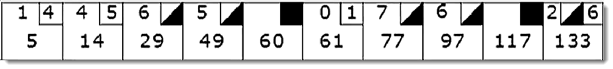

== Bowling Game Rules



=== Deutsch

Das Spiel besteht aus 10 Frames, wie oben gezeigt. In jedem Frame hat der Spieler zwei Gelegenheiten, 10 Pins umzuwerfen. Die Punktzahl für den Frame ergibt sich aus der Gesamtzahl der umgeworfenen Pins, plus Boni für Strikes und Spares.

Ein Spare ist, wenn der Spieler alle 10 Pins in zwei Versuchen umwirft. Der Bonus für diesen Frame ist die Anzahl der Pins, die beim nächsten Wurf umgeworfen werden. In Frame 3 oben ist die Punktzahl also 10 (die Gesamtzahl der umgeworfenen Pins) plus ein Bonus von 5 (die Anzahl der beim nächsten Wurf umgeworfenen Pins).

Ein Strike ist, wenn der Spieler alle 10 Pins beim ersten Versuch umwirft. Der Bonus für diesen Frame entspricht dem Wert der nächsten beiden geworfenen Kugeln.

Im zehnten Frame darf ein Spieler, der einen Spare oder einen Strike geworfen hat, die zusätzlichen Kugeln werfen, um den Frame abzuschließen. Es können jedoch nicht mehr als drei Kugeln im zehnten Frame geworfen werden.


=== English

The game consists of 10 frames as shown above. In each frame the player has two opportunities to knock down 10 pins. The score for the frame is the total number of pins knocked down, plus bonuses for strikes and spares.

A spare is when the player knocks down all 10 pins in two tries. The bonus for that frame is the number of pins knocked down by the next roll. So in frame 3 above, the score is 10 (the total number koncked down) plus a bonus of 5 (the number of pins knocked down on the next roll.)

A strike is when the player knocks down all 10 pins on his first try. The bonus for that frame is the value of the next two balls rolled.

In the tenth frame a player who rolls a spare or a strike is allowed to roll the extra balls to complete the frame. However no more than three balls can be rolled in tenth frame.

== Schritte Kata

.TODOs für JavaDoc der Test-Klasse
```
/**
 * TODOs
 *
 * 1. Test: can roll gutter (no pins at all)
 * 2. Test: can roll One's 20 times
 * 3. Test: Spare
 * 4. Test: Strike
 * 5. Test: Perfect Match
 */
```

=== Testklasse initial anlegen und ausprobieren

```java
package ccsc.bowling;

import org.junit.jupiter.api.Test;

import static org.junit.jupiter.api.Assertions.*;

class GameTest {

    @Test
    void nothing_to_test_yet() {
        assertTrue(true);
    }
}
```

Assertion über `Assertions.assertTrue(true)` und dann ⌥ + ⏎ für Quickfix -> Static Import

Organize Imports über ⌃ + ⌥ + O

TODO-Liste in Klassen-JavaDoc kopieren.

=== Erste Testmethode: Kann Spiel Instanz erzeugen

Dummy-Test-Methode löschen/überschreiben

```
    @Test
    void can_create_game() {
        Game game = new Game();
        assertNotNull(game);
    }
```

Compilerfehler -> Klasse Game unter src/main/java anlegen

⌥ + ⏎ für Quickfix und Create Class, richtiges Source-Verzeichnis setzen (src/main/java)

=== Erste Spielsituation: 20 mal 0 geworfen

[plantuml, target=diagram-classes, format=png]
....
@startuml
class Game {
    + roll(pins : int)
    + score() : int
}
@enduml
....

`roll(pins)`wird jedes Mal aufgerufen, wenn ein Spieler die Kugel rollt. Das Argument ist die Anzahl der umgeworfenen Pins.

`score()` wird nur einmal am Ende des Spiels aufgerufen, es gibt die Gesamtpunktzahl für dieses Spiel zurück.

```
    @Test
    void can_roll_gutter_game() {
        Game game = new Game();
        for (int i = 0; i < 20; i++) {
            game.roll(0);
        }
        Assertions.assertEquals(0, game.getScore());
    }
```

Kompiliert wieder nicht, Methoden `roll()` und `getScore()` anlegen (Option + Enter) und ganz einfach implementieren

```java
public class Game {
    public void roll(int pins) {
    }

    public int getScore() {
        return 0;
    }
}
```

Tests laufen lassen, sind zufälligerweise beide grün.

Danach ersten Test löschen, weil die Erzeugung von game indirekt beim zweiten Schritt mitgeprüft wird.

=== Nächste Variante: 20 mal 1 geworfen

```
    @Test
    void can_roll_all_ones() {
        Game game = new Game();
        for (int i = 0; i < 20; i++) {
            game.roll(1);
        }
        Assertions.assertEquals(20, game.getScore());
    }
```

Test schlägt fehl. `roll()` und `getScore()` richtig implementieren, aber einfachste Lösung suchen.

```java
public class Game {
    private int score = 0;

    public void roll(int pins) {
        score += pins;
    }

    public int getScore() {
        return score;
    }
}
```

Tests sind wieder grün.

=== Refactoring der Tests

⌃ + T (oder Shift + Shift: Refactor this) => Introduce Field

`setup()` anlegen und Zuweisung des neuen Feldes

```java
package ccsc.bowling;

import org.junit.jupiter.api.Assertions;
import org.junit.jupiter.api.BeforeEach;
import org.junit.jupiter.api.Test;

import static org.junit.jupiter.api.Assertions.*;

class GameTest {

    private Game game;

    @BeforeEach
    void setup() {
        game = new Game();
    }

    @Test
    void can_roll_gutter_game() {
        for (int i = 0; i < 20; i++) {
            game.roll(0);
        }
        Assertions.assertEquals(0, game.getScore());
    }

    [...]
}
```

zweimal Introduce Variable (⌃ + T): rolls + pins

Extract Method (⌥ + ⌘ + M): rollMany

Inline (⌥ + ⌘ + N) rolls + pins

```java
class GameTest {

    private Game game;

    @BeforeEach
    void setup() {
        game = new Game();
    }

    @Test
    void can_roll_gutter_game() {
        rollMany(20, 0);
        Assertions.assertEquals(0, game.getScore());
    }

    private void rollMany(int rolls, int pins) {
        for (int i = 0; i < rolls; i++) {
            game.roll(pins);
        }
    }

    @Test
    void can_roll_all_ones() {
        rollMany(20, 1);
        Assertions.assertEquals(20, game.getScore());
    }
}
```


Tests sind weiterhin grün.

=== Spare werfen

Neue Testmethode implementieren, Test sind rot.

```
    @Test
    void can_roll_spare() {
        game.roll(5);
        game.roll(5); // spare
        game.roll(3);
        rollMany(17, 0);
        assertEquals(16, game.getScore());
    }
```

Man könnte in Versuchung kommen, sich ein Flag zu merken, wenn es ein Spare gab, um dann den nächsten Wurf noch dazuzuzählen.

Aber das macht bei einem Strike nur noch mehr Probleme. Das Design scheint falsch zu sein.

`roll()` berechnet den Score, aber der Name zeigt das gar nicht.

`score()` berechnet nichts, aber der Name lässt dies vermuten.

Das Design ist falsch, die Verantwortlichkeiten sind falsch platziert.

Neuen Test erstmal auskommentieren, dann die Klasse Game umbauen.

=== Umbau der Klasse Game

Minimal invasiver Umbau, alten Code lassen und neuen Code hinzufügen.

```java
package ccsc.bowling;

public class Game {

    private int score = 0;
    private int rolls[] = new int[21];
    private int currentRoll = 0;

    public void roll(int pins) {
        score += pins;
        rolls[currentRoll++] = pins;
    }

    public int getScore() {
        return score;
    }
}
```

`score()` umbauen und wenn Test grün ist, die alte `score`-Variable rauslöschen.

Für `for`-Schleife mit Live-Template `fori` arbeiten.

```java
package ccsc.bowling;

public class Game {

    private int rolls[] = new int[21];
    private int currentRoll = 0;

    public void roll(int pins) {
        rolls[currentRoll++] = pins;
    }

    public int getScore() {
        int score = 0;
        for (int i = 0; i < rolls.length; i++) {
            score += rolls[i];
        }
        return score;
    }
}
```

Tests sind grün, jetzt kann wieder das Spare in Angriff genommen werden.

=== Spare implementieren

Spare-Test wieder einkommentieren.

Aber der Test schlägt natürlich wieder fehl. Wir haben das Konzept der Frames (zwei Rolls) noch nicht bedacht. Das Design ist also weiterhin falsch. Wir müssen durch das Array immer in zwei Schritten (Bälle, ein Frame) durchlaufen.

Test wieder auskommentieren und `score()` umbauen. Vorsicht, for-Schleife darf nur `frame` und nicht `i` enthalten.

```java
    public int getScore() {
        int score = 0;
        int i = 0;
        for (int frame = 0; frame < 10; frame++) {
            score += rolls[i] + rolls[i+1];
            i += 2;
        }
        return score;
    }
```

=== Neuer Versuch für Spare

Neue Testmethode wieder einkommentieren, Test ist natürlich wieder rot.

`score()` umbauen.

```java
    public int getScore() {
        int score = 0;
        int i = 0;
        for (int frame = 0; frame < 10; frame++) {
            if (rolls[i] + rolls[i+1] == 10) { // spare
                score += 10 + rolls[i + 2];
            } else {
                score += rolls[i] + rolls[i + 1];
            }
            i += 2;
        }
        return score;
    }
```

Test ist jetzt grün.

Refactoring: Variable `i` ist schlecht, durch `frameIndex` ersetzen. Die beiden Kommentare (`// spare`) in Game und GameTest sind auch schlecht.

Extract Method `isSpare()` und Kommentar entfernen.

```java
    public int getScore() {
        int score = 0;
        int frameIndex = 0;
        for (int frame = 0; frame < 10; frame++) {
            if (isSpare(frameIndex)) {
                score += 10 + rolls[frameIndex + 2];
            } else {
                score += rolls[frameIndex] + rolls[frameIndex + 1];
            }
            frameIndex += 2;
        }
        return score;
    }

    private boolean isSpare(int frameIndex) {
        return rolls[frameIndex] + rolls[frameIndex + 1] == 10;
    }
```

In `GameTest` ebenfalls Extract Method anwenden.

```java
    @Test
    void can_roll_spare() {
        rollSpare();
        game.roll(3);
        rollMany(17, 0);
        assertEquals(16, game.getScore());
    }

    private void rollSpare() {
        game.roll(5);
        game.roll(5);
    }
```

=== Strike spielen

Neue Test-Methode anlegen.

```java
    @Test
    void can_roll_one_strike() {
        game.roll(10); // strike
        game.roll(3);
        game.roll(4);
        rollMany(16, 0);
        assertEquals(24, game.getScore());
    }
```

Test schlägt fehl, außerdem gibt es wieder einen unnötigen Kommentar (`// strike`). Erweiterung der `score()`-Methode.

```java
    public int getScore() {
        int score = 0;
        int frameIndex = 0;
        for (int frame = 0; frame < 10; frame++) {
            if (rolls[frameIndex] == 10) { // strike
                score += 10 + rolls[frameIndex + 1] + rolls[frameIndex + 2];
                frameIndex++;
            } else if (isSpare(frameIndex)) {
                score += 10 + rolls[frameIndex + 2];
                frameIndex += 2;
            } else {
                score += rolls[frameIndex] + rolls[frameIndex + 1];
                frameIndex += 2;
            }
        }
        return score;
    }
```

Test ist grün, aber wieder einige Code-Smells:

* hässlicher Kommentar bei 'if' (`// strike`)
* hässliche Ausdrücke `rolls[frameIndex]` (mit +1 und +2)

Extract methods, sprechende Namen für die Conditionals und Zweige erstellen.

```java
    public int getScore() {
        int score = 0;
        int frameIndex = 0;
        for (int frame = 0; frame < 10; frame++) {
            if (isStrike(frameIndex)) {
                score += 10 + strikeBonus(frameIndex);
                frameIndex++;
            } else if (isSpare(frameIndex)) {
                score += 10 + spareBonus(frameIndex + 2);
                frameIndex += 2;
            } else {
                score += sumOfBallsInFrame(rolls[frameIndex], rolls[frameIndex + 1]);
                frameIndex += 2;
            }
        }
        return score;
    }

    private int sumOfBallsInFrame(int rolls, int rolls1) {
        return rolls + rolls1;
    }

    private int spareBonus(int frameIndex) {
        return rolls[frameIndex];
    }

    private int strikeBonus(int frameIndex) {
        return rolls[frameIndex + 1] + rolls[frameIndex + 2];
    }

    private boolean isSpare(int frameIndex) {
        return rolls[frameIndex] + rolls[frameIndex + 1] == 10;
    }
    private boolean isStrike(int frameIndex) {
        return rolls[frameIndex] == 10;
    }
```

GameTest refactoren, `// strike` Kommentar mit Extract Method eliminieren.

```java
    @Test
    void can_roll_one_strike() {
        rollStrike();
        game.roll(3);
        game.roll(4);
        rollMany(16, 0);
        assertEquals(24, game.getScore());
    }

    private void rollStrike() {
        game.roll(10);
    }
```

=== Letzter Test: Perfektes Spiel

```java
    @Test
    void can_play_perfect_game() {
        rollMany(12, 10);
        assertEquals(300, game.getScore());
    }
```

Alle Tests sind grün.

Das ist das Ende der normalen Bowling Game Kata. Man kann jetzt noch intern umbauen, so dass es ein besseres objektorientiertes Design gibt.

=== Umbau in OO-Design

[plantuml, target=diagram-classes, format=png]
....
@startuml
class Game {
    + roll(pins : int)
    + score() : int
}

Game "1" --right-- "10" Frame : \t\t
Frame "1" -right- "1..2" Roll : \t\t
TenthFrame -up-^ Frame
TenthFrame -up- "2..3" Roll
@enduml
....

Nicht trivial, die möglichen 12 - 23 Würfe (10 Frames) zu parsen und daraus 10 Frame-Instanzen zu machen. Bei zwei Strikes nacheinander, muss beim ersten Strike auch der erste Wurf des übernächsten Frames mit dazu gezählt werden. Theoretisch bräuchte ein Frame neben seinen beiden Rolls auch eine Referenz auf das nächste Frame, um an die beiden nächsten Rolls (potentiell auch im übernächsten Frame) ranzukommen. Schwierig ist es auch, den letzten Frame, der aus zwei oder drei Rolls bestehen kann, zu extrahieren.

Vorteil von dieser Implementierung ist die leichtere Darstellung des Gesamtergebnis mittels toString()-Ausgaben. Ggf. reicht es auch, einem Frame die Infos über seine beiden Würfe und im Falle eines Strikes/Spares die Zusatzpunkte mitzugeben. Die Logik passiert dann aber komplett außerhalb.
